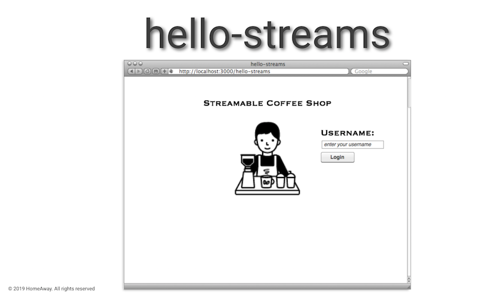
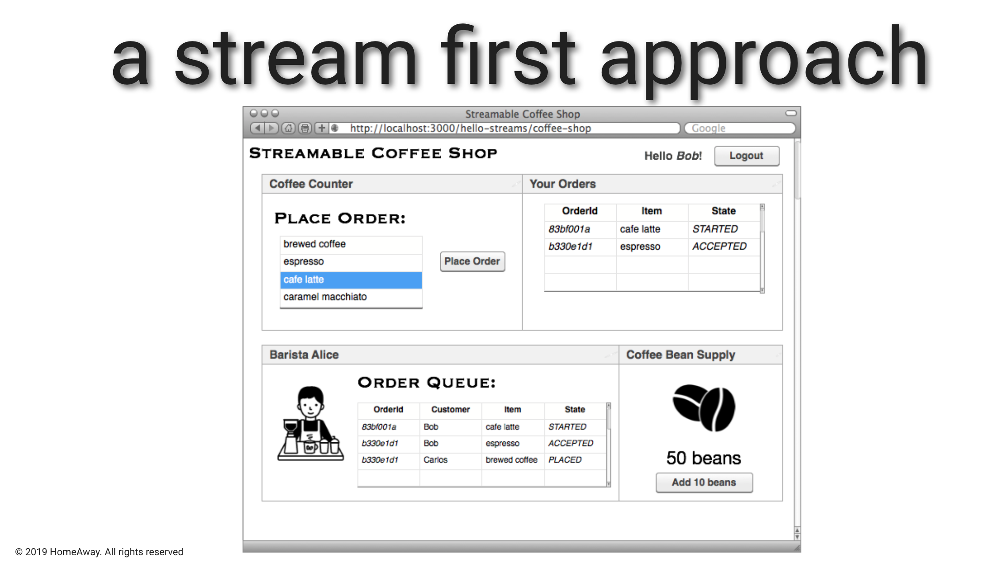

# hello-streams :arrows_counterclockwise:

## What is this?

`hello-streams` is a demo application presented at [kafka-summit 2019](https://kafka-summit.org/sessions/hello-streams-introducing-stream-first-mindset/) entitled 'hello-streams :: Introducing the "streams-first" mindset'.

## Why make this

To provide insight into an opinionated solution using NodeJS, Java, GraphQL, Kafka, and Kafka-Streams to implement an event-driven-design using event-sourcing, [domain events](https://medium.com/@ha_reneparra/https-medium-com-neoword-domain-events-45697ec0271f), [business events](https://medium.com/homeaway-tech-blog/business-events-in-a-world-of-independently-deployable-services-144daf6caa1a), and [command events](https://medium.com/homeaway-tech-blog/command-events-b8942e251824).





### Pre-Requisites:

- OpenJDK
- Node + YARN
- docker + docker-compose

### To Build everything:
- Ensure confluent stack is running

```bash
make start-confluent
```

- Build everything

```bash
make build
```

### To Run everything:

- Run each following line in a separate terminal window:
```bash
(cd order-processor && make run)
(cd bean-processor && make run)
(cd barista-processor && make run)
(cd order-cleaner && make run)
(cd coffee-shop-service && make run)
(cd coffee-shop && make run)
```
